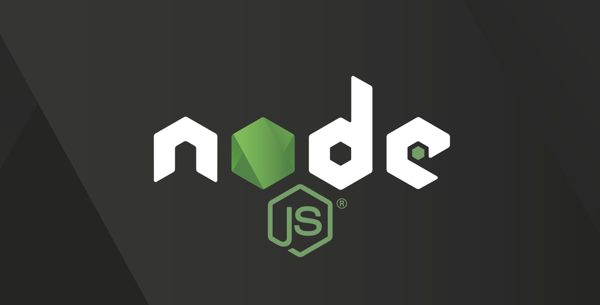
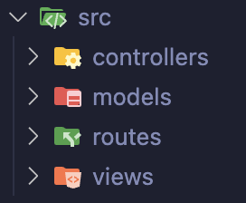

# Proyecto MVC - Citas Hospitalarias
Este proyecto implementa un sistema de citas hospitalarias mediante una estructura de Arquitectura Modelo-Vista-Controlador (MVC) en Node.js. La aplicación permite registrar pacientes y asignarles citas con médicos predefinidos en el sistema.



## Descripción de la Aplicación
La aplicación proporciona una funcionalidad básica de gestión de citas para hospitales:

- Registro de usuarios (pacientes).
- Asignación de citas a pacientes con médicos que ya están definidos en el sistema.

## Estructura de Carpetas
La organización del proyecto sigue la estructura MVC para lograr una clara separación de responsabilidades:

```plaintext
src
├── controllers  # Controladores para gestionar el flujo de la aplicación
├── models       # Modelos de datos que representan la estructura de la base de datos
├── routes       # Rutas disponibles en la aplicación
└── views        # Vistas para la representación de la interfaz de usuario
app              # Inicialización de todos los procesos
```


## Arquitectura Usada: MVC
La arquitectura Modelo-Vista-Controlador (MVC) permite organizar el código y las carpetas para una mayor claridad y mantenibilidad:

- Modelo (Model): Define la estructura de los datos y las interacciones con la base de datos.
- Vista (View): Define la interfaz de usuario que será presentada al usuario.
- Controlador (Controller): Gestiona la lógica de negocio y se comunica tanto con los modelos como con las vistas.

## Flujo de la Aplicación
1. El usuario accede a una ruta en la aplicación.
2. La ruta llama al controlador correspondiente.
3. En el controlador, se ejecuta la lógica de negocio y se interactúa con la base de datos.
4. Finalmente, el controlador responde con una vista (para mostrar datos) o con un código de estado (para indicar el resultado de una operación).
